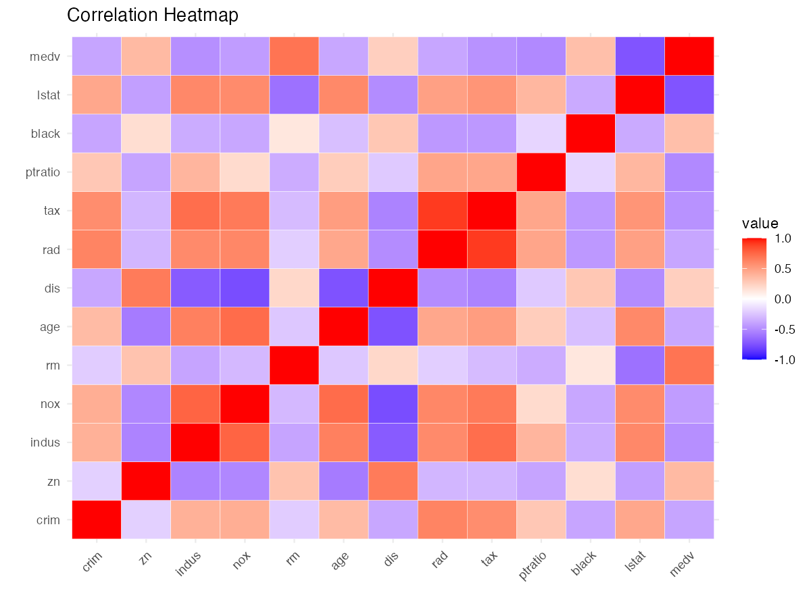
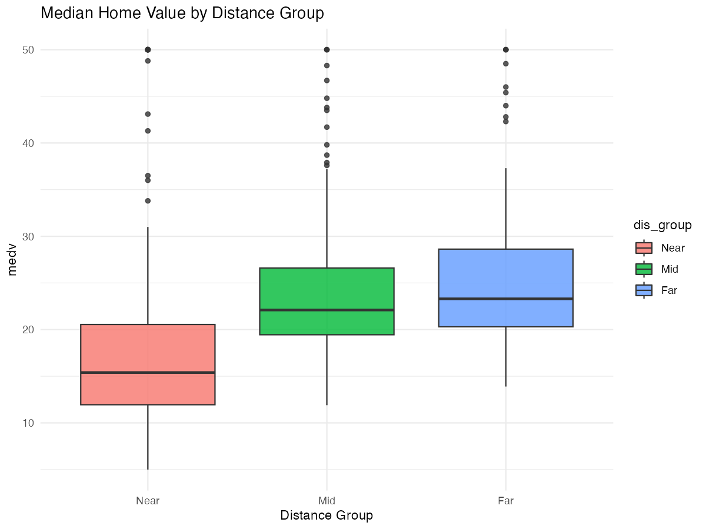
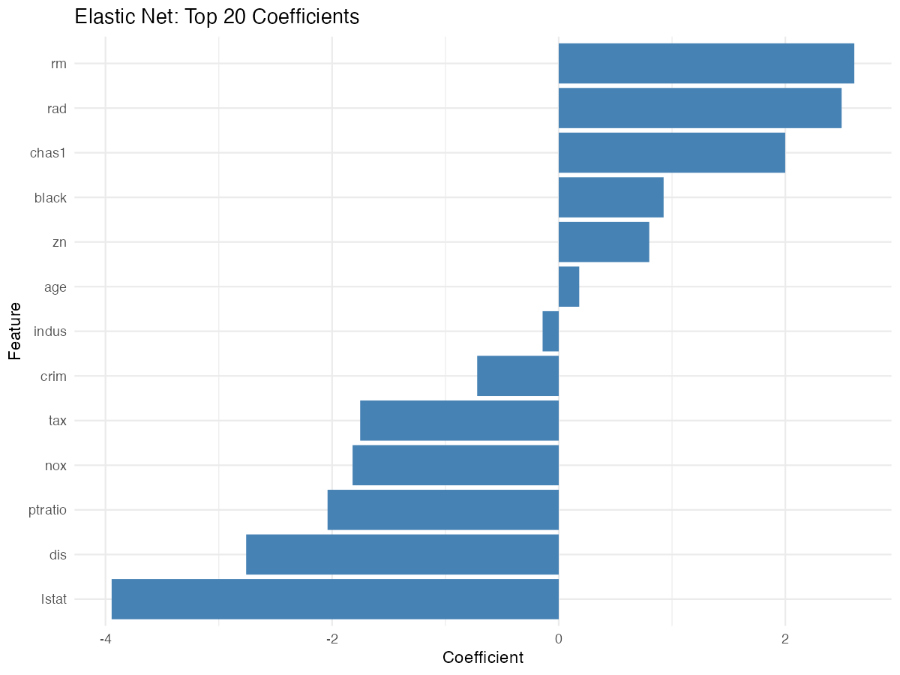

|                                  |
|----------------------------------|
| title: “Boston Housing Analysis” |
| author: “Teesha Ahuja”           |
| output:                          |
| html_document:                   |
| toc: true                        |
| toc_float: true                  |
| number_sections: false           |

\# Overview

This report summarizes an end-to-end analysis of the Boston housing
dataset, including cleaning, exploratory data analysis, cross-validated
modeling, diagnostics, and hypothesis testing.

\# Data and Methods

- Dataset: `Boston.csv`
- Models: Linear Regression, Elastic Net (glmnet), Random Forest, GBM
- Validation: 5x3 repeated CV on training; final evaluation on hold-out
  test set
- Diagnostics: VIF, Breusch–Pagan, Shapiro–Wilk, Cook’s distance
- Inference: ANOVA on distance groups; ANCOVA on `ptratio` and `rm`

\# Key Results

\## Model Performance

``` r
results_path <- file.path("results", "model_comparison_results.csv")
results <- read.csv(results_path)
results %>% arrange(RMSE)
```

    ##                          Model     RMSE        R2
    ## 1 Stochastic Gradient Boosting 3.118511 0.8894275
    ## 2                Random Forest 3.137636 0.8921611
    ## 3            Linear Regression 4.588948 0.7611260
    ## 4                       glmnet 4.595970 0.7621994

\## Correlation Heatmap

``` r
knitr::include_graphics(file.path("figures", "correlation_heatmap.png"))
```



\## Distance Group vs MEDV

``` r
knitr::include_graphics(file.path("figures", "boxplot_medv_by_dis_group.png"))
```



\## Elastic Net Top Coefficients

``` r
knitr::include_graphics(file.path("figures", "elastic_net_top20_coefficients.png"))
```



\# Interpretation

- Tree-based models (RF/GBM) achieve the lowest RMSE on the test set.
- Important features include `rm` (positive), `lstat` (negative), `dis`,
  `rad`, and `ptratio`.
- Linear model assumptions show heteroskedasticity and non-normal
  residuals; consider robust SEs or alternative models for inference.

\# Reproducibility

- Session info saved to `results/sessionInfo.txt`.
- Random seed set for comparability.
